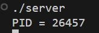
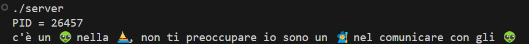

# Minitalk (42 Firenze)

## Introduction

Minitalk  is a project made up of two main that together, these programs implement a simple interprocess communication system using signals to send and receive messages bit by bit.

# [Subject](./Docks/subject/minitalk.subject.pdf)






## Testing

Enter the folder where the Makefile is and open two terminals:

Terminal server:

```bash
make
./server
```

The server must have generated a PID that you will have to insert into the client stack.

PID = 23225

MSG = Next to the PID you will have to enter a message between ```" "``` put whatever you prefer

Terminal client:

```bash
./client 23225 "msg"
```
